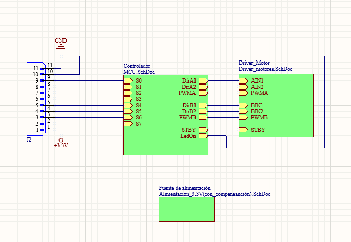
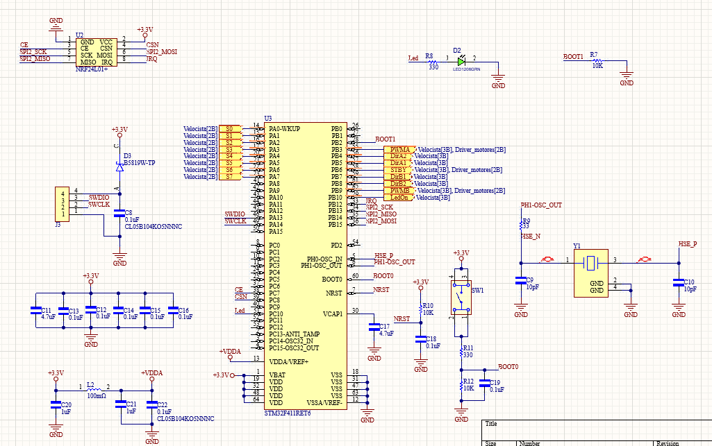
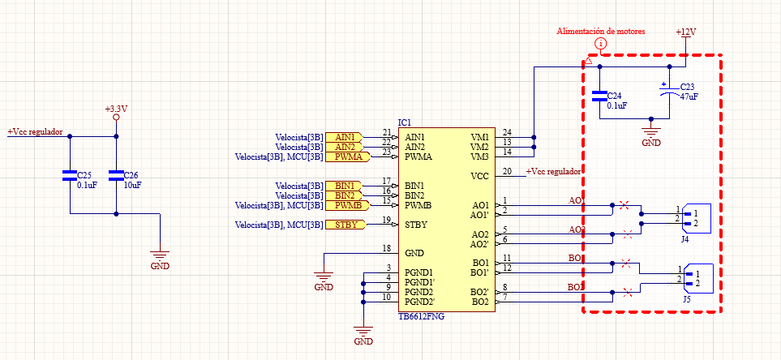
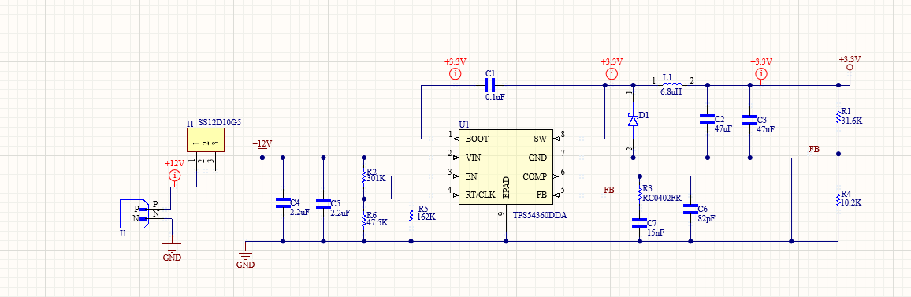
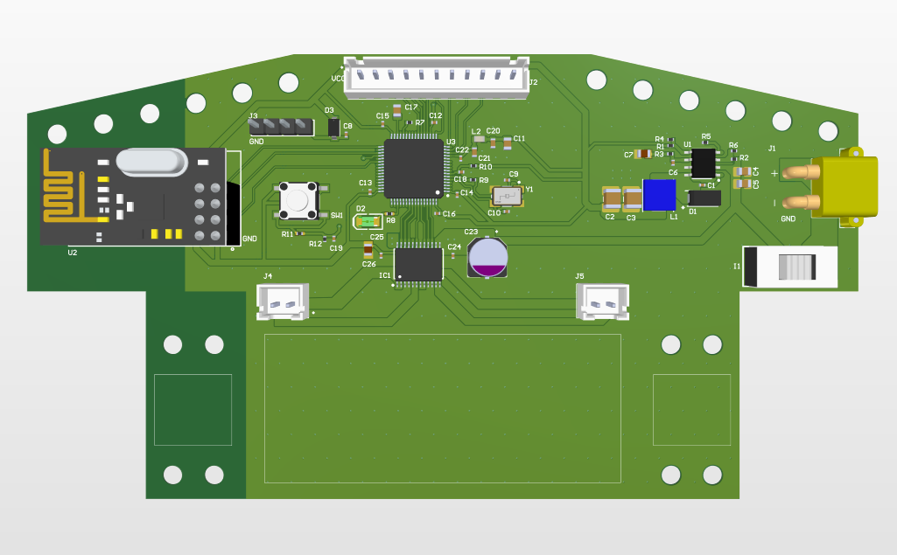

# 🏎️ Robot Velocista Senior (STM32 Control)

Proyecto de alto rendimiento desarrollado con **STM32CubeIDE** y diseñado en **Altium Designer**. Este repositorio contiene el diseño electrónico detallado y próximamente el firmware de control.

## 📐 Diseño Electrónico (Hardware)

El sistema ha sido modularizado para maximizar la eficiencia y el orden en el PCB.

### 1. Esquema General del Sistema

### 2. Módulos Críticos
| Microcontrolador (MCU) | Etapa de Potencia (Driver) |
| :---: | :---: |
|  |  |

### 3. Fuente de Alimentación
Diseño de regulación para asegurar estabilidad en los sensores y el MCU.

## 🖼️ Resultado del Diseño de PCB
Vista del ruteado final y disposición de componentes.

## 🚧 Estado del Proyecto
- [x] Diseño de esquemáticos en Altium
- [x] Diseño de PCB
- [x] Fabricación de PCBs (Recibidas)
- [ ] Montaje de componentes
- [ ] Programación en STM32CubeIDE
